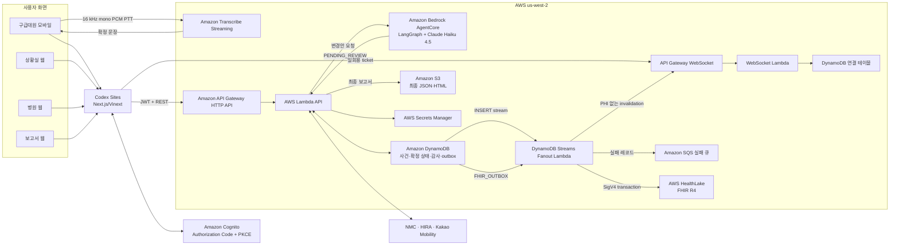

# EMS Relay 구현 보고서

작성 기준: 2026-08-03 · AWS 계정 `462993243992` · 리전 `us-west-2`

## 1. 구현 결과 요약

EMS Relay는 구급대원, 이송조정 상황실, 병원 수용 담당자가 하나의 사건 상태를 공유하면서 다음 과정을 처리하는 서버리스 웹 서비스다.

1. 구급대원이 모바일에서 업무 시각을 기록하고 환자 정보를 직접 입력하거나 PTT로 말한다.
2. Amazon Transcribe Streaming이 음성을 문장으로 변환한다. 원본 음성은 서버에 저장하지 않는다.
3. Amazon Bedrock AgentCore의 LangGraph 멀티에이전트가 문장에서 근거가 있는 변경안만 만든다.
4. 구급대원이 변경안을 선택·확인해야만 환자 확정 상태가 갱신된다.
5. NMC·HIRA 기관 정보를 합치고 Kakao Mobility의 실제 도로 거리·ETA를 붙여 탐색 범위를 보여준다.
6. 병원 담당자가 추가정보 요청, 수용 가능 또는 수용 곤란을 직접 회신한다.
7. 수용 가능 회신 후에도 최종 이송지는 구급대원이 별도로 확정한다.
8. 이송·재평가·병원 도착·인계를 기록한 뒤 구급활동일지 초안을 만들고 사람이 최종 검토한다.
9. 최종 확정본은 S3에 JSON·HTML로 보관되고 FHIR R4 transaction Bundle로 HealthLake에 발행된다.

AI가 진단, 병원 추천 점수, 수용 가능성 예측, 최종 이송 결정을 수행하지 않는 것이 제품의 핵심 안전 경계다.

## 2. 배포 주소와 접근 정책

- 서비스: <https://ems-relay-gangwon-mvp.gsgxgsbs.chatgpt.site>
- 현재 접근 정책: Codex Sites `private/owner-only`
- 모바일 화면: `/paramedic`
- 상황실 화면: `/control`
- 병원 화면: `/hospital`
- 보고서 화면: `/reports`
- 로그인: `/login`

이 링크는 서버리스로 배포되어 있으나 현재 소유자 전용이다. 팀 공유 또는 외부 시연에는 Sites 접근 권한을 별도로 열거나 다른 공개 호스팅 대상으로 재배포해야 한다.

운영 시연 사건은 `GW-CARDIO-051`을 사용한다. 이 사건은 `ASSIGNED v1`, 임상 사실 0건, 병원 문의 0건인 깨끗한 시작 상태다. `GW-CARDIO-050`은 전체 파이프라인 검증을 완료한 보관용 E2E 사건이며, 후보 병원 제한 수정 전에 생성된 이력이 있으므로 UI 시연에는 사용하지 않는다.

## 3. 배포 아키텍처



### 3.1 음성 경로

- 브라우저의 `AudioWorklet`이 마이크 입력을 16 kHz, mono, PCM으로 변환한다.
- 90 ms 단위로 Amazon Transcribe Streaming WebSocket에 전송하고 버튼을 놓을 때 남은 샘플을 flush한다.
- 백엔드는 300초 유효 presigned WSS 세션만 발급한다.
- 최종 인식 문장이 나온 뒤 AgentCore 변경안 요청을 보낸다.
- raw WAV/PCM을 S3, DynamoDB, 로그에 저장하지 않는다. `/health`도 `audioStorage: disabled`를 반환한다.

### 3.2 AgentCore 멀티에이전트

```text
korean_ems_fact_extractor
  -> clinical_tool_dispatch
  -> clinical_tools (LangGraph ToolNode)
  -> evidence_safety_reviewer
  -> handoff_proposal_composer
```

- 모델: `global.anthropic.claude-haiku-4-5-20251001-v1:0`
- temperature: `0.3`
- Runtime은 IAM 인증만 허용하며 브라우저에서 직접 호출하지 않는다.
- 추출 에이전트는 문장에 실제로 있는 후보만 만든다.
- 도구 노드는 단위 정규화, 넓은 기술적 범위 검사, 원문 evidence span 매핑을 수행한다.
- 검토 에이전트는 후보를 추가·수정하지 못하며 위험도만 높일 수 있다.
- 작성 에이전트는 검증된 후보의 순서만 구성한다.
- 결과는 항상 `PENDING_REVIEW`, `requiresHumanReview: true`, `authoritative: false`다.
- 실행 trace에는 역할·도구명·결과 코드·인덱스·해시만 남고 원문·환자값·도구 인자는 남기지 않는다.

### 3.3 병원 참고정보와 수용 회신

- 후보의 기준 집합은 NMC 응급의료기관이다.
- HIRA는 같은 기관의 기본정보를 보강하며 NMC 기관 정체성이나 응급의료 단계 값을 덮어쓰지 않는다.
- Kakao Mobility REST API는 실제 도로 거리와 예상 이동시간을 제공한다.
- 조회 응답의 `acceptance_status`는 항상 `not_provided`다. 이 API들로 병원 수용 여부를 추정하지 않는다.
- 병원 수용 여부는 해당 병원 Cognito 계정이 EMS Relay에서 직접 회신한 값만 사용한다.
- `DECLINED`에는 사유 코드 또는 사유 문구가 필요하고, `ACCEPTED` 회신 뒤 구급대원이 별도로 이송지를 확정한다.

### 3.4 실시간 동기화

- 로그인 사용자가 REST로 사건별 5분 유효·1회용 WebSocket ticket을 발급받는다.
- `$connect` Lambda가 ticket을 소비하고 사건·역할·병원 범위에 맞는 연결만 등록한다.
- DynamoDB Streams Fanout은 확정된 사건 이벤트가 생겼다는 무민감정보 invalidation만 보낸다.
- 클라이언트는 알림을 받으면 `GET /cases/{id}`를 다시 호출한다. WebSocket 메시지 자체에 환자 상세정보를 싣지 않는다.

### 3.5 보고서와 FHIR

- 병원 인계 단계 이후에만 구급활동일지 초안을 생성한다.
- 화면 검토 구역은 환자 인적사항, 증상·발생시각, 환자평가, 구급대원평가, 응급처치, 의료지도, 이송, 인계의 8개다.
- 필수 업무 시각, 최초 활력·측정시각, 이송지, 인수자·직종·인계시각, 출동대 정보가 없으면 최종 확정할 수 없다.
- HTML 출력은 「119구조·구급에 관한 법률 시행규칙」 별지 제5호서식의 기록 항목 순서를 반영한 한 페이지 전자작성본이다. 스키마 식별자는 `KR_AMBULANCE_ACTIVITY_ANNEX5_MVP_V1`이다.
- 현재 구현은 공식 전자결재·서명·소방 시스템 전송을 대체하는 인증 서식이 아니라 대응 작성본이다.
- 최종 확정과 `FHIR_OUTBOX` 생성을 하나의 DynamoDB transaction으로 묶는다.
- Stream Fanout이 outbox를 처리해 HealthLake에 idempotent `PUT` transaction Bundle을 보낸다.
- FHIR 리소스는 Patient, Encounter, Observation, ClinicalImpression, MedicationStatement, Procedure, Provenance이며, 활력징후에는 LOINC·UCUM을 사용한다.
- 실패한 stream batch는 3회 재시도·분할 후 암호화된 SQS 실패 큐에 보낸다.

## 4. 사용자별 실제 워크플로

### 4.1 상황실

1. 신고 기반의 최소 정보로 사건을 생성하고 구급대를 배정한다.
2. 신고 시각·출동 배정 내용을 확인한다.
3. 이후 사건 상태, 병원 문의, 회신, 이송·인계 진행을 읽기 전용으로 감시한다.
4. 임상값 확인, 병원 회신, 최종 이송지 결정은 대신 수행하지 않는다.

### 4.2 구급대원

1. 배정 목록에서 사건을 선택한다.
2. `출동 시작`, `현장 도착`, `환자 접촉` 버튼으로 서버 시각을 기록한다.
3. 연령·성별·주호소·발생시각·AVPU와 BP, PR, RR, SpO₂, 체온, 혈당을 직접 입력하거나 PTT 변경안으로 받는다.
4. AI 변경안마다 원문 근거와 값을 확인하고 수락 또는 제외한다.
5. NMC allowlist, HIRA 보강, Kakao 거리·ETA를 보고 문의할 병원을 선택한다.
6. 병원에 수용 문의를 보내고 추가정보 요청이 오면 답한다.
7. 수용 가능 회신을 받은 병원 중 실제 이송지를 직접 확정한다.
8. `이송 시작`, 이송 중 재평가, `병원 도착`, 인계 전송을 기록한다.
9. 인수 확인 후 보고서 8개 구역을 검토하고 최종 확정한다.

### 4.3 병원 수용 담당자

1. 자신의 `custom:hospital_id`와 일치하는 문의만 본다.
2. 문의 열람을 기록한다.
3. 필요한 경우 추가정보를 요청한다.
4. `수용 가능` 또는 사유를 포함한 `수용 곤란`을 한 번만 최종 회신한다.
5. 실제 도착 후 인수자 이름·직종을 확인하고 인수 완료를 기록한다.
6. 다른 병원의 문의, 전체 환자 보고서, 최종 이송 결정 권한은 없다.

## 5. 실제 AWS 배포 상태

| 구분 | 실제 값/상태 |
|---|---|
| CloudFormation stack | `ems-relay-backend` · `UPDATE_COMPLETE` |
| HTTP API | `https://322rrfmbme.execute-api.us-west-2.amazonaws.com` |
| WebSocket | `wss://4zwsk5dhvc.execute-api.us-west-2.amazonaws.com/prod` |
| Cognito User Pool | `us-west-2_U8OPmgc5R` |
| Cognito SPA client | `3g1ruv6gk8rd63iea0q5i4fiu` |
| Cognito Hosted UI | `https://ems-relay-462993243992-us-west-2.auth.us-west-2.amazoncognito.com` |
| Case table | `ems-relay-backend-CaseTable-6OEBP7LSGS5G` |
| Connection table | `ems-relay-backend-ConnectionTable-1DUS309BOX2T3` |
| Report bucket | `ems-relay-backend-reportbucket-gh0aw9yqohil` |
| AgentCore Runtime | `EMSRelayProposal-plEVqA20bj` · `READY` |
| AgentCore endpoint | `DEFAULT` |
| HealthLake datastore | `b93de77cda6c8d6b8c6663df64d89bec` · `ACTIVE` |
| 외부 API secret | `ems-relay/external-api-keys` |
| 데모 사용자 secret | `ems-relay/demo-users` |

Lambda는 Node.js 22, arm64, 512 MB, 30초로 구성했다. DynamoDB는 on-demand, SSE, 사건 테이블 PITR, stream, TTL을 사용한다. 보고서 버킷은 public access를 차단하고 AES-256, versioning, 현 버전 30일·이전 버전 7일 lifecycle을 적용했다. Lambda 로그 보존은 14일이다.

## 6. 인증·권한·안전 경계

- Cognito Authorization Code + PKCE를 사용하고 SPA client secret은 만들지 않는다.
- access/id token은 15분, refresh token은 1일이며 token revocation을 사용한다.
- 역할은 `paramedic`, `control`, `hospital`, `admin` 그룹으로 구분한다.
- actor, role, 병원 ID는 요청 본문이 아니라 검증된 JWT claim에서만 가져온다.
- 사건 접근은 배정 구급대원, 상황실·관리자, 해당 병원으로 제한한다.
- 명령은 `commandId` 멱등성 키와 `expectedVersion` 낙관적 잠금을 사용한다.
- 환자 확정 상태, 감사기록, 업무 이벤트는 DynamoDB transaction으로 같이 저장한다.
- AI는 confirmed state를 직접 수정할 client나 endpoint를 갖지 않는다.
- 확인하지 못한 값은 채우지 않고 `미상` 또는 `확인 필요`로 유지한다.
- NMC·HIRA·Kakao는 참고정보이며 수용 가능성·치료 적합성·의학적 판단을 제공하지 않는다.
- 이 배포는 합성 사건을 이용한 실증용이다. 실제 119 CAD, 병원 EMR, NEDIS, 법정 전자서명 체계와 연결되기 전에는 실제 환자 업무에 사용해서는 안 된다.

## 7. 검증 결과

### 7.1 자동 검증

| 영역 | 결과 |
|---|---|
| 프론트 소스 테스트 | 18/18 통과 |
| 프론트 TypeScript | 통과 |
| 프론트 ESLint | 통과 |
| 프론트 의존성 보안 검사 | `npm audit` 취약점 0건 |
| 백엔드 테스트 | 24/24 통과 |
| SAM template lint | 통과 |
| AgentCore 테스트 | 14/14 통과 |
| AgentCore coverage | 88.27% · 기준 85% 이상 |
| AgentCore Ruff | 통과 |

프론트 테스트에는 Cognito state·nonce, 안전한 return path, 90 ms PCM batch와 final flush, 역할 화면, 전체 상태머신, 병원 회신 분기, 빈 운영 화면, 미확인값 비추정이 포함된다. 백엔드 테스트에는 JWT 역할, optimistic transaction, NMC allowlist·HIRA enrichment, AgentCore 비권위 응답, 보고서 접근 제한, FHIR idempotent Bundle, 별지 제5호 항목 순서가 포함된다.

### 7.2 실제 클라우드 E2E 증거

- `/health`: `status=ok`, `agentRuntimeConfigured=true`, `directBedrockFallbackEnabled=false`, `audioStorage=disabled`.
- AgentCore 실호출: `PENDING_REVIEW`, human review 필수, authoritative false, 3 agent, 18 tool calls, PHI trace false.
- 병원 참고정보 실호출: 속초의료원은 `NMC+HIRA+KAKAO`, 약 1.8 km·6분으로 반환됐고 수용 상태는 `not_provided`였다.
- WebSocket probe: TLS `wss` 연결 성공, 일회용 ticket 소비 성공.
- 운영 사건 `GW-CARDIO-051`: `ASSIGNED v1`, 배정 이벤트만 존재, 확정 임상 사실·문의·이송지 없음. 상황실과 배정 구급대원 조회는 200, 문의받지 않은 병원은 403.
- 보관용 E2E 사건 `GW-CARDIO-050`: 전체 lifecycle `COMPLETE v18`, 병원 회신, 최초·재평가 확정, 보고서 `FINALIZED v3`, FHIR outbox `PUBLISHED`, `FHIR_PUBLISHED` 이벤트 확인.
- S3: 위 사건의 최종 HTML·JSON 2개 객체 확인.
- HealthLake: 최종 보고서의 FHIR transaction 발행 완료, datastore `ACTIVE`.

Cloud seed는 배포된 Lambda에 API Gateway 형식의 역할 claim을 넣어 workflow와 권한 분기를 검증한다. 따라서 Cognito Hosted UI의 실제 브라우저 로그인 확인을 대체하지 않는다. 또한 자동 E2E는 실제 마이크 장치를 재현하지 않는다. 배포 사이트의 Chrome/Edge에서 로그인하고 마이크 권한을 허용한 뒤 PTT 시작·중앙 실시간 문장·버튼 해제 후 최종 문장·검토 화면까지 마지막 수동 인수 테스트를 해야 한다.

## 8. 남은 배포 제약

### Kakao JavaScript 지도 도메인

Kakao Mobility REST 길찾기는 서버에서 실제 호출되고 있다. 그러나 브라우저 Kakao Map JavaScript SDK는 Kakao Developers 콘솔에 아래 도메인을 등록해야 한다.

```text
https://ems-relay-gangwon-mvp.gsgxgsbs.chatgpt.site
```

현재 콘솔 로그인 세션이 없어 이 등록은 완료하지 못했다. 등록 전에는 병원 목록·거리·ETA·길찾기 링크는 작동하지만 지도 패널은 fallback 안내를 표시할 수 있다. 프론트 배포 환경에는 `NEXT_PUBLIC_KAKAO_MAP_JAVASCRIPT_KEY`만 주입하며 Admin key는 사용하지 않는다.

## 9. HealthLake 비용과 종료 계획

HealthLake datastore는 `ACTIVE`인 동안 시간 기반 비용이 계속 발생하므로 해커톤 종료 후 가장 먼저 삭제해야 한다. 현재 구현에는 AWS Scheduler 기반 자동 삭제 리소스가 포함되어 있지 않다. 프로젝트 종료 목표 시각인 **2026-08-08 09:00 KST** 전후에 [`OPERATIONS.md`](./OPERATIONS.md)의 확인·백업·삭제 절차를 사람이 실행하고 상태가 `DELETED`가 될 때까지 확인해야 한다.

CloudFormation stack만 삭제해도 HealthLake와 `Retain` 설정의 Cognito User Pool, 사건 DynamoDB, 보고서 S3는 남는다. 완전 종료 시 이 리소스를 각각 삭제해야 한다.
